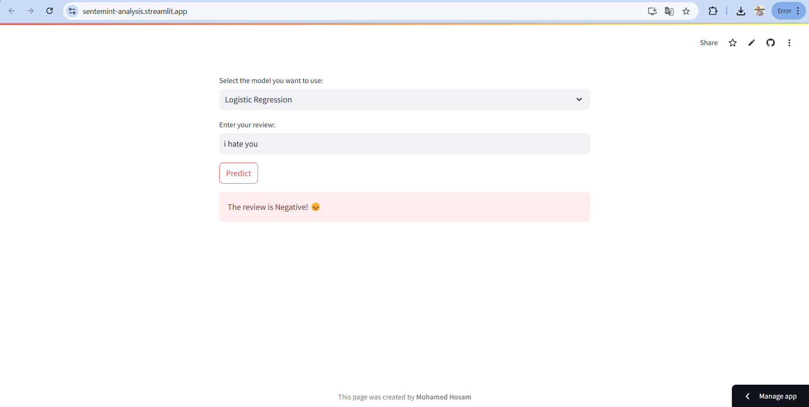
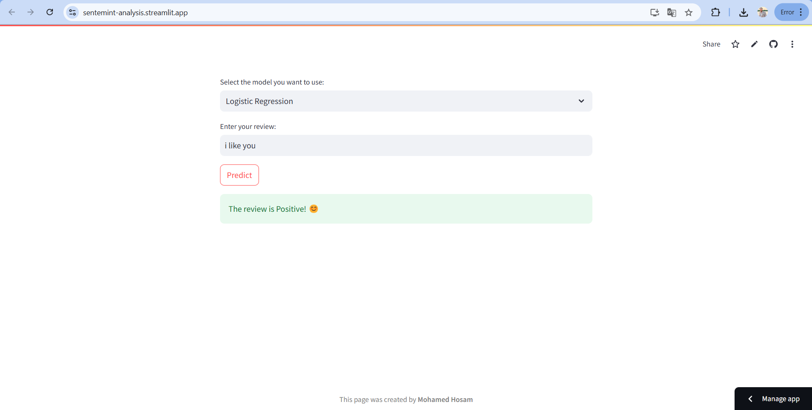

# Sentiment Analysis Web App

This project implements a sentiment analysis web application built using **Streamlit** and **Natural Language Processing (NLP)** techniques. The app allows users to input text and receive real-time sentiment analysis results.

## 🌟 Features:
- Real-time sentiment analysis of text inputs.
- Visualized sentiment scores for better understanding.

## 🧑‍💻 Technologies Used:
- Python
- Streamlit
- Natural Language Processing (NLP)
- Machine Learning

## 🔧 Installation:
1. Clone the repository:
    ```bash
    git clone https://github.com/mohamedhosam4/odc_Sentemint-Analysis
    ```
2. Install dependencies:
    ```bash
    pip install -r requirements.txt
    ```
3. Run the app locally:
    ```bash
    streamlit run app.py
    ```

## 📸 App Screenshot:




## 📝 Acknowledgments:
This project was developed as part of the **AI and Data Science Scholarship** from **Orange Digital Center**, in collaboration with **Amit Learning**. Special thanks to the mentors and team for their invaluable guidance and support.
